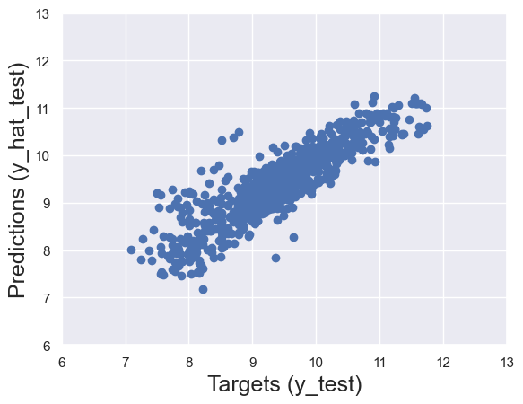

# Used Car Price Prediction

This project is a machine learning model that predicts the price of a used car based on its specifications. The model uses linear regression to estimate the logarithm of the car price from various features extracted and preprocessed from a real-world dataset.

## Dataset

The dataset used is "1.04. Real life example.csv" which contains used car listings with the following key features:

- Brand
- Mileage
- Year of production
- Engine volume
- Model (dropped during preprocessing)

## Features and Preprocessing

- Missing values were removed from the dataset.
- Outliers in Price, Mileage, Engine Volume, and Year were identified and removed based on quantile thresholds.
- The price was log-transformed to relax linear regression assumptions.
- Multicollinearity was detected between Year and Mileage; Year was dropped to reduce redundancy.
- Categorical variables such as Brand, Body type, and Engine Type were converted to dummy variables.
- Features were scaled using StandardScaler before training.

## Model

- A linear regression model was trained on the preprocessed and scaled features.
- The model predicts the logarithm of the car price.
- Model performance was evaluated using training and test data with scatter plots and residual analysis.

## How to Run

1. Ensure you have the required libraries installed: numpy, pandas, statsmodels, matplotlib, seaborn, scikit-learn.
2. Load the dataset `1.04. Real life example.csv` in the same directory.
3. Run the Jupyter notebook `Car Price Predictor.ipynb` step-by-step to preprocess data, train the model, and evaluate results.

## Results

- The model shows good fit on training data with residuals approximately normally distributed.
- Predictions on test data are close to actual values with small percentage differences.

## Dependencies

- Python 3.x
- numpy
- pandas
- statsmodels
- matplotlib
- seaborn
- scikit-learn
